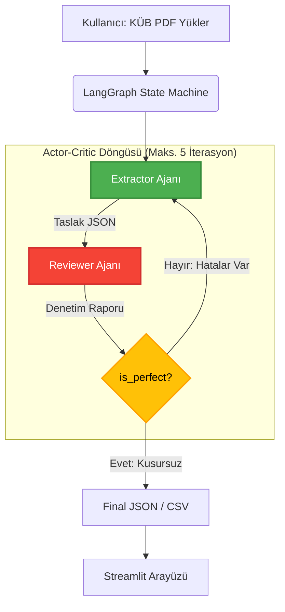

# 💊 PharmAgent: Agentic KÜB Data Extraction System


**PharmAgent**, Türkiye'de ilaç kutularından çıkan ve resmi olarak onaylanan **Kısa Ürün Bilgisi (KÜB)** dokümanlarından farmakovijilans verilerini (Bölüm 4.8 İstenmeyen Etkiler) T.C. Sağlık Bakanlığı standartlarına uygun, %100 otonom ve yüksek doğrulukla çıkaran **Çoklu Ajan (Multi-Agent)** sistemidir.

---

## 🧠 Mimarisi: Actor-Critic (Çıkarıcı - Denetleyici) Döngüsü

Bu proje, yapılandırılmamış ve karmaşık KÜB PDF'lerinden yapılandırılmış (Structured JSON/CSV) veri çıkarmak için sıradan bir API çağrısı yerine **LangGraph** destekli, kendi kendini düzeltebilen bir yapay zeka döngüsü kullanır.

### Nasıl Çalışır?
1. **Extractor (Actor):** PDF'i okur, **yalnızca "Bölüm 4.8 İstenmeyen Etkiler"** bölümüne odaklanarak yan etkileri çıkarır. Eğer yan etkiler etken maddeye göre gruplanmışsa (kombinasyon ilaçlar), `active_ingredient` alanını ilgili etken maddeyle doldurur; tek etken maddeli ürünlerde bu alan `null` bırakılır.
2. **Reviewer (Critic):** Extractor'ın ürettiği veriyi şüpheci (Adversarial) bir persona ile satır satır denetler. Kurallara uymayan bir SOC veya frekans atlaması varsa, hataları raporlayarak JSON'u reddeder.
3. **Döngü:** Hata varsa süreç tekrar Extractor'a döner, kusursuz olana (veya maksimum iterasyon sınırına ulaşana) kadar düzeltme devam eder.



---

## 🚀 Projedeki İleri Seviye (Advanced) AI Teknikleri

- **Prompt Minification (Bilgi Damıtma):** 17 KB boyutundaki devasa Sağlık Bakanlığı yönergesi, sadece kritik kuralları (Geçerli SOC Listesi, Frekans Eşikleri vb.) içeren 1 KB'lık `kompakt_kilavuz.txt` dosyasına dönüştürülerek "Lost in the Middle" sendromu engellenmiş ve maliyet %90 azaltılmıştır.
- **Adversarial Prompting (Şüpheci Kimlik):** Aynı model kullanıldığı için "Kör Nokta (Confirmation bias)" oluşmaması adına Reviewer ajanı *"Extractor tembeldir, ona asla güvenme, açık bul"* şeklinde özel bir persona ile kodlanmıştır.
- **Chain of Thought (Sesli Düşünme):** Reviewer ajanı karara (True/False) varmadan önce Pydantic şemasındaki `audit_reasoning` alanı sayesinde zorunlu olarak sesli düşünür ve kendi mantığını test eder.
- **Inline Binary Extraction:** PDF'lerin File API'ye yüklenirken güvenlik duvarlarında (Firewall) takılıp bağlantı (WinError 10053) koparmaması için dokümanlar doğrudan `bytes` formatında belleğe okunarak API'ye iletilir.
- **Exponential Backoff & Retry (`tenacity`):** Geçici API hataları (rate limit, timeout) karşısında sistemi çöktürmek yerine, `tenacity` kütüphanesi ile otomatik yeniden deneme (retry) mekanizması uygulanmıştır. Her denemede bekleme süresi katlanarak artar, bu sayede kararlılık artırılmış ve manuel müdahale ihtiyacı ortadan kaldırılmıştır.

---

## 🛠️ Kurulum ve Kullanım

### 1. Depoyu Klonlayın
```bash
git clone https://github.com/esguner/kubagent.git
cd kubagent
```

### 2. Gerekli Kütüphaneleri Yükleyin
```bash
pip install -r requirements.txt
```

### 3. Çevre Değişkenlerini (Environment) Ayarlayın
Proje ana dizininde `.env` isimli bir dosya oluşturun ve Google Gemini API anahtarınızı ekleyin:
```ini
GEMINI_API_KEY="AIzaSyYourKeyHere..."
```

### 4. Uygulamayı Başlatın
```bash
streamlit run app.py
```
*(Tarayıcınızda otomatik olarak Streamlit arayüzü açılacaktır. Arayüzden PDF yükleyip, ajanların anlık tartışmalarını konsoldan izleyebilirsiniz.)*

---

## 🗂️ Çıktı Formatı (JSON Örneği)

Çıkarılan her bir yan etki aşağıdaki Pydantic şemasında standartlaştırılır:
```json
{
    "active_ingredient": "Parasetamol",
    "soc": "Bağışıklık sistemi hastalıkları",
    "frequency": "Yaygın olmayan",
    "adverse_effect": "Döküntü",
    "context": "Aşırı duyarlılık belirtileri"
}
```

---
*Geliştirici:* [Serdar] ve Yardımcı Arkadaşları :) | *Lisans:* MIT
