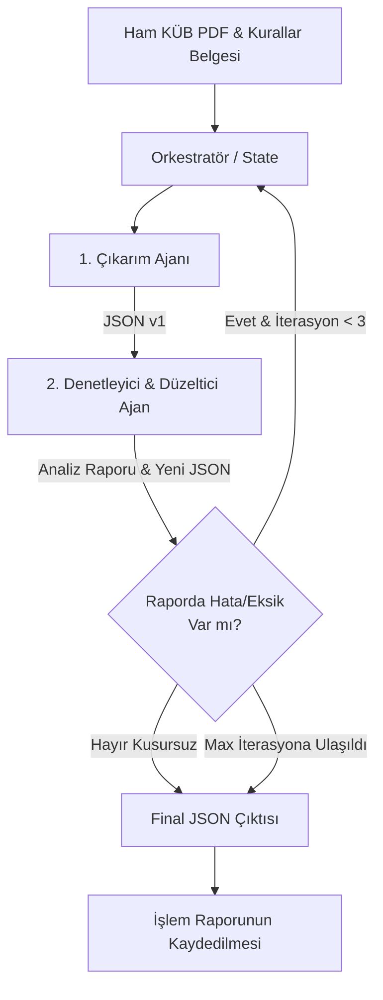

# KÜB Yan Etki Çıkarım Sistemi - Ajan Tabanlı Mimari (Agentic Architecture) Planı

## Proje Özeti
KÜB (Kısa Ürün Bilgisi) dokümanlarının "4.8. İstenmeyen Etkiler" bölümünden etken madde, sistem organ sınıfı (SOC), frekans ve yan etki bilgilerinin LLM tabanlı iki modül (Ajan) arasında kurulan geri bildirim döngüsü ile en yüksek doğrulukta (sıfır halüsinasyon, eksiksiz veri) JSON formatında çıkarılması.

## Ajan (Agent) Rolleri ve Döngü Mimarisi (Actor-Critic / Generator-Evaluator Loop)

Baharsettiğiniz ikili modül yapısı literatürde **Actor-Critic (Yapan-Denetleyen)** veya **Reflexion (Yansıma/Öz-düzeltme)** mimarisi olarak bilinir ve bilgi çıkarımı (Information Extraction) görevlerinde tekil LLM çağrılarına göre muazzam bir doğruluk artışı sağlar.

### 1. Çıkarım Ajanı (Extractor Agent - Modül 1)
- **Görevi:** KÜB 4.8 metnini ve "Kurallar Belgesini" girdi olarak alıp, belirlenen JSON şemasına uygun ilk çıkarımı yapmak.
- **Yeteneği:** Karmaşık tıbbi metinleri yapılandırılmış veriye çevirmek (Structured Output). Bu ajan, veriyi sınıflandırma ve formatlama konusunda uzmandır.

### 2. Denetleyici ve Düzeltici Ajan (Reviewer/Editor Agent - Modül 2)
- **Görevi:** Orijinal KÜB metni ile Çıkarım Ajanının ürettiği JSON çıktısını karşılaştırmak. 
- **Mantığı:** Çıkarım ajanı gibi "üretmeye" değil, bir "eleştirmen" gözüyle "eksik/hata aramaya" odaklanır. Kurallar belgesine uyulup uyulmadığını, frekansların doğru eşleşip eşleşmediğini ve atlanan (extract edilmeyen) yan etki olup olmadığını kontrol eder.
- **Çıktısı:** Tespit edilen hataların/eksiklerin bir raporu (Review Report) ve düzeltilmiş yeni JSON versiyonu.

### 3. Orkestratör (Supervisor / State Manager)
- **Görevi:** Döngüyü yönetmek. Denetleyici Ajan "Herhangi bir hata bulunamadı, JSON orijinal metinle ve kurallarla %100 uyumlu" raporu verene kadar (veya sonsuz döngüyü önlemek için maksimum iterasyon limitine -örn. 3 iterasyon- ulaşılana kadar) işlemi tekrar ettirmek.

## Önerilen Teknoloji Yığını (Tech Stack)
- **Orkestrasyon:** `LangGraph` (Döngüsel/Cyclic ajan mimarileri ve durum/state yönetimi için endüstri standardıdır) veya PydanticAI.
- **Veri Modelleme:** `Pydantic` (JSON şemasını, zorunlu alanları ve veri tiplerini LLM'e dayatmak için "Structured Outputs" yeteneği ile).
- **LLM:** `Gemini 2.5 Flash` veya `Gemini 2.5 Flash-Lite` (Maliyet avantajı, yüksek hız ve bütün bir PDF dosyasını **Native/Çok Modlu** olarak doğrudan işleyebilme yeteneği sayesinde).
- **Belge İşleme & Katı Kısıtlama (Strict Constraint):** Metin kırpma işlemi YAPILMAYACAK. PDF dosyaları doğrudan LLM'e gönderilecek. Ancak ajanlara verilecek sistem promptunda **"KESİNLİKLE VE YALNIZCA '4.8. İstenmeyen Etkiler' başlığı altındaki verileri analiz et. Belgenin başka hiçbir bölümündeki (örn: 4.4 Özel Uyarılar veya 4.9 Doz Aşımı) yan etkileri ÇIKARMA!"** şeklinde çok katı bir kural (guardrail) eklenecektir.

## İş Akışı (Workflow) Şeması




- **JSON Şeması Belirlendi:** Çıktı formatı, kullanıcının talebi doğrultusunda aşağıdaki gibi yapılandırılmıştır:
```json
{
  "active_ingredient": "Parasetamol",
  "soc": "Bağışıklık sistemi hastalıkları",
  "frequency": "Yaygın olmayan",
  "adverse_effect": "Döküntü",
  "context": "Anaflaktoid reaksiyonlar ile ilişkili"
}
```

## Proje Kararları (Final Decisions)
- **Programlama Dili & Çerçeve:** Python ve LangGraph kullanılacaktır.
- **Kullanım Arayüzü:** Çekirdek mantık modüler olarak yazılacak, ancak kullanımı ve test edilmesi kolay olsun diye ajanların geri bildirim döngüsünü (Reviewer'ın bulduğu hataları ve Extractor'ın düzeltmelerini) ekranda adım adım görselleştiren şık bir **Streamlit Web Arayüzü** geliştirilecektir. İstendiğinde bu çekirdek mantık toplu işlemler (batch) için de çağrılabilecektir.
- **Sistem Promptu:** Kullanıcının eski projesindeki başarılı kurallar ("NO HALLUCINATED SOCs", "EXCLUDE HEADERS" vb.) korunacak ve "Sadece 4.8 bölümünden çıkarım yapılması" kısıtlamasıyla birleştirilerek en güçlü hale getirilecektir.
Projenin kodlamasına geçersek şu adımları izleyeceğiz:
1. Pydantic ile JSON (Data Model) sınıflarının oluşturulması.
2. Extractor (Çıkarıcı) ve Reviewer (Denetleyici) ajanların promptlarının hazırlanması (Kurallar belgesi buraya yedirilecek).
3. LangGraph ile "State" yapısının ve döngünün (conditional edges) kurulması.
4. Python scriptinin (veya arayüzün) yazılması.

## Verification Plan
1. Sistem hazırlandıktan sonra karmaşık yapılı 3-4 örnek KÜB 4.8 metni ile deneme çalıştırılması.
2. Ajanların aralarındaki "tartışma/düzeltme" loglarının incelenerek modül 2'nin gerçekten fayda sağlayıp sağlamadığının test edilmesi.
3. Çıktı JSON verisinin manuel doğrulama ile eksiksiz olduğunun teyit edilmesi.
